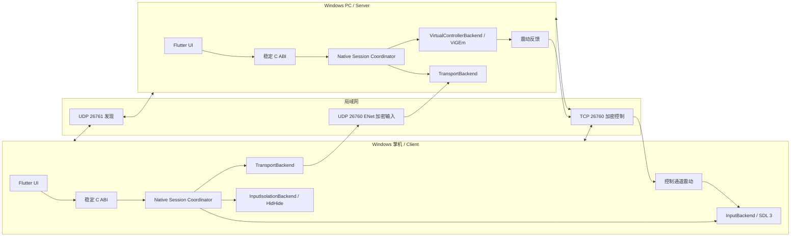

# Remote Controller 项目知识库

最后更新：2026-07-23
状态：M0 初始化完成；M1 会话、loopback 与安全归零底座完成，硬件后端进行中
许可证：GPL-3.0-only

本文件是架构、协议、上游来源和关键实现决策的单一事实来源。修改架构、协议、依赖、驱动策略或关键实现时，必须在同一变更中更新本文件。

## 1. 项目目标与功能边界

Remote Controller 在同一局域网内把 Windows 掌机的实体手柄状态发送到 Windows PC。掌机端只在会话期间独占手柄，PC 端呈现一个虚拟 Xbox 360 手柄，PC 游戏产生的双马达震动再返回实体手柄。

MVP 固定边界：

- 一个 Flutter Windows 可执行程序，通过角色选择运行 Client 或 Server。
- Client 首要支持 ROG Ally X 内置手柄；已知 USB VID/PID 为 `0x0B05/0x1B4C`，最终仍以 SDL 枚举结果和 Windows 设备实例路径为准。
- 单客户端、单实体手柄、单虚拟手柄。
- 标准 Xbox 控件：D-pad、A/B/X/Y、Start、Back、Guide、肩键、摇杆按压、双摇杆、双扳机。
- 保留采集后整数域中的原始轴值，不应用应用层死区、加速、灵敏度曲线或平滑。允许进行坐标约定转换，例如 SDL 的 Y 正方向到 XInput 的 Y 正方向。
- M1/M2 背键、触摸板、陀螺仪、RGB、扳机震动和多手柄延后，但协议和接口须可扩展。
- 不实现音视频、远程桌面、键盘、鼠标、触摸板输入、原始 USB/HID 透传或互联网中继。
- HidHide、ViGEmBus 驱动只做检测并链接官方安装说明，不重新分发驱动二进制。

## 2. 总体架构与模块职责



### Flutter 层

- `ui/`：只负责界面、交互和展示状态；采用 View + `ChangeNotifier` ViewModel。
- `data/repositories/`：向 ViewModel 提供领域对象，是界面的单一数据入口。
- `data/services/`：封装 FFI 调用，不承担实时循环。
- `domain/models/`：角色、核心状态、设备/会话展示模型。
- Flutter 通过轮询事件或原生端口通知获得低频状态；任何输入采样、网络收发或虚拟手柄提交都不得经过 Flutter UI isolate。

### Windows C/C++ 核心

- Session Coordinator：状态机、生命周期、超时、停止顺序和后端组合。
- `InputBackend`：枚举、打开、读取实体手柄以及执行震动。
- `InputIsolationBackend`：按会话开始/结束实体设备隔离。
- `TransportBackend`：发现、控制、输入传输和反馈；具体实现可替换。
- `VirtualControllerBackend`：创建/销毁虚拟设备、提交完整状态、立即提交中立状态、接收震动回调。
- Crypto/Pairing：身份、配对、密钥派生、重放保护和 DPAPI 持久化。

当前 C++ 后端接口位于 `packages/remote_controller_core/native/include/backends/`，协议布局位于 `native/include/controller_protocol.h`。`Session` 组合具体后端并拥有状态机、sequence 校验和 watchdog；当前诊断组合为异步 `LoopbackTransportBackend` + `MemoryVirtualControllerBackend`，后续 SDL/ENet/ViGEm 不改变上层会话 ABI。

## 3. Flutter FFI 边界

FFI 只暴露面向会话的粗粒度 API，不暴露 C++ 类、STL 类型或实时数据回调。所有结构带 `size`/`version`，字符串使用 UTF-8，资源通过 opaque handle 管理。

目标生产 ABI v1 仍将补充配置、设备枚举、配对和事件轮询：

```c
rc_handle* rc_create_v1(const rc_config_v1* config);
rc_result rc_start(rc_handle* handle);
void rc_stop(rc_handle* handle);
void rc_destroy(rc_handle* handle);
rc_result rc_get_status(rc_handle* handle, rc_status_v1* out_status);
rc_result rc_poll_event(rc_handle* handle, rc_event_v1* out_event);
rc_result rc_list_input_devices(rc_handle* handle, rc_device_list_v1* out_devices);
rc_result rc_select_device(rc_handle* handle, const char* device_id_utf8);
rc_result rc_pair_confirm(rc_handle* handle, uint32_t six_digit_code);
```

已经实现的 ABI：

- `rc_get_abi_version()`：当前返回 1。
- `rc_get_build_info()`：返回进程生命周期有效的 UTF-8 构建描述。
- `rc_session_create_loopback()` / `rc_session_destroy()`：创建和销毁 opaque `rc_session`；超时允许 `10..5000 ms`，产品默认值为 100 ms。
- `rc_session_start()` / `rc_session_stop()`：严格执行 `created → running → stopped` 生命周期；Stop 幂等并先提交中立状态。
- `rc_session_submit_state()`：提交完整 16 字节状态、64 位 sequence 和 Client 单调时间戳；相同或倒退 sequence 返回 `RC_RESULT_STALE_SEQUENCE`。
- `rc_session_get_snapshot()`：低频读取状态机、最新 sequence、接收/归零计数、输入时间戳和当前完整输出状态。
- `rc_session_simulate_disconnect()`：仅用于诊断断线安全路径；真实传输后端将从控制通道关闭回调进入同一路径。

当前公开状态结构 `rc_session_snapshot_v1` 首字段为 `struct_size`，大小为 56 字节；`rc_gamepad_state_v1` 与 wire 明文同为 16 字节。opaque handle 不跨 DLL 暴露 C++、STL 或线程对象。Dart `LoopbackSession` 是显式 `close()` 资源；Flutter service 只用它运行粗粒度自检，实时状态不会经 Dart 往返。

绑定由 `packages/remote_controller_core/tool/ffigen.dart` 生成到 `lib/src/third_party/`，不得手写 `DynamicLibrary.lookup`。Native Assets 通过 `hook/build.dart` 和 `hook/link.dart` 构建 C++20 动态库并根据记录的符号使用进行链接裁剪。

## 4. 线程模型

### 通用线程

- Flutter UI isolate：设置、配对确认、状态展示；不进入实时路径。
- Native control thread：会话状态机、TCP 控制消息、1 秒心跳、配对和配置。
- Native event queue：有界 MPSC 队列，把状态/错误事件交给 FFI；队列满时合并重复状态，不能丢失致命错误。

当前已实现的诊断线程：

- Loopback transport worker：`SendState()` 把带 sequence/timestamp 的完整 `StateFrame` 写入最大 64 项的有界队列并唤醒工作线程；仅当相邻状态的按钮掩码完全相同时覆盖队尾，从而允许高频轴状态合并但不丢失按下/松开边沿。队列耗尽时会话失败并安全归零，不静默丢边沿。工作线程回调 Session，调用者线程不直接执行虚拟手柄提交。
- Session watchdog：独立线程以本机 `steady_clock` 计算接收超时，不信任远端 timestamp；每段输入静默期只提交一次中立状态，收到新合法状态后重新布防。
- Stop 和模拟断线均显式唤醒并 join 线程。当前使用 `std::thread` + `condition_variable` 作为 C++20 `stop_token` 的等价取消机制。

### Client

- Input thread：高优先级事件循环读取 SDL 3。按键边沿立即形成完整状态；仅当按钮掩码不变时，允许在 4 ms 发送周期内合并轴事件。
- Input TX thread：维护单调序列号和时间戳，序列化、AEAD 加密并交给 ENet。最多 250 Hz；即使无变化也每 20 ms 发送完整状态心跳。
- Rumble dispatch：控制线程收到可靠震动消息后投递到 InputBackend；不得阻塞控制通道。
- Input 与 TX 之间使用固定容量 SPSC 环形队列和“最新完整状态”槽，避免堆分配。

### Server

- Input RX thread：ENet 收包、认证、版本/会话/长度/序列验证，写入最新状态槽。
- Virtual controller thread：消费最新合法完整状态并调用 ViGEm；按钮边沿不合并。100 ms 未收到合法输入时立即提交中立状态。
- ViGEm callback thread：回调内只复制震动数据到有界队列；控制线程去重后可靠回传，绝不在驱动回调里做网络阻塞操作。

线程停止时使用 `std::stop_token` 或等价取消源。析构函数只是最后保险，正常路径必须显式 Stop 并 join。

## 5. 通信协议 v1

### 端口和通道

| 用途 | 传输 | 端口 | 可靠性 |
|---|---|---:|---|
| 服务发现 | UDP broadcast/multicast | 26761 | 周期广播，可丢失 |
| 配对、能力、心跳、震动、停机会话 | TCP + AEAD framing | 26760 | 可靠有序 |
| 手柄完整状态 | ENet/UDP | 26760 | 低延迟；完整状态允许丢旧包 |

TCP 与 UDP 可以使用相同数字端口。发现报文只暴露协议版本、随机设备 ID、显示名、角色和控制端口；不发送长期公钥之外的敏感材料。

### 输入数据报

固定 64 字节，小端序。头部作为 AEAD AAD，16 字节状态区域加密，尾部为 16 字节认证标签。

| 偏移 | 大小 | 字段 | 说明 |
|---:|---:|---|---|
| 0 | 4 | magic | `RCI1` / `0x31494352` |
| 4 | 1 | version | 1 |
| 5 | 1 | message_type | 1 = full state |
| 6 | 2 | flags | v1 为 0，未知必需位则拒绝 |
| 8 | 2 | packet_length | 64 |
| 10 | 2 | header_length | 32 |
| 12 | 4 | session_id | 配对后每次会话随机生成 |
| 16 | 8 | sequence | 从随机/协商起点单调递增，不回绕复用 |
| 24 | 8 | timestamp_us | Client 单调时钟微秒，只用于测量和排序 |
| 32 | 16 | encrypted_state | 下表明文经 AEAD 后的密文 |
| 48 | 16 | authentication_tag | AEAD tag |

状态明文：

| 偏移（状态内） | 大小 | 字段 | 数值域 |
|---:|---:|---|---|
| 0 | 4 | button_flags | Moonlight/Sunshine 兼容 32 位掩码 |
| 4 | 2 | left_trigger | `0..65535` 原始归一整数 |
| 6 | 2 | right_trigger | `0..65535` 原始归一整数 |
| 8 | 2 | left_stick_x | `-32768..32767` |
| 10 | 2 | left_stick_y | `-32768..32767` |
| 12 | 2 | right_stick_x | `-32768..32767` |
| 14 | 2 | right_stick_y | `-32768..32767` |

Xbox 360 虚拟报告的扳机只有 8 位。Server 在最终 ViGEm 边界进行确定性 `uint16 -> uint8` 量化；网络和 Client 内部始终保留 16 位数值。不得在传输前缩减精度。

按钮位：

| 位 | 值 | 控件 |
|---:|---:|---|
| 0..3 | `0x0001..0x0008` | D-pad 上/下/左/右 |
| 4..9 | `0x0010..0x0200` | Start、Back、LS、RS、LB、RB |
| 10 | `0x0400` | Guide/Home |
| 12..15 | `0x1000..0x8000` | A、B、X、Y |

高 16 位保留 Moonlight/Sunshine 扩展（paddles、touchpad、misc），MVP 不发送但不得截断。

### 加密与配对

- 每个安装生成 Ed25519 长期身份密钥，私钥用 Windows DPAPI Current User 保存。
- 首次配对通过 TCP 交换带长期身份签名的临时 X25519 公钥。
- 双方从握手 transcript 派生六位确认码，用户在两端确认一致后保存对端身份。
- 会话密钥通过 X25519 secret + HKDF-SHA-256 派生；控制、Client→Server 输入、Server→Client 反馈使用不同方向密钥。
- 计划使用 libsodium（ISC）实现 Ed25519、X25519 和 ChaCha20-Poly1305，避免自己实现密码原语；正式引入时需固定版本和来源。
- 输入 nonce 由方向常量、session ID 和 sequence 唯一构造。Server 维护滑动重放窗口，拒绝重复、过旧、认证失败或会话不匹配的包。

### 控制消息

带 `version/type/length/request_id` 的长度前缀帧，握手完成后全部加密。v1 至少包括：HELLO、PAIR_REQUEST、PAIR_CONFIRM、CAPABILITIES、START_SESSION、STOP_SESSION、HEARTBEAT、RUMBLE、ERROR。能力协商包含控制器类型、支持按钮、模拟扳机、普通震动以及最大输入频率。

## 6. 故障恢复和安全释放

任何不确定状态都以“释放所有控件”为安全结果：

- Server 100 ms 无合法输入：立即向虚拟手柄提交一次中立完整状态，并保持中立直到收到更新会话或有效恢复包。
- TCP 控制通道关闭、AEAD 连续失败、session ID 变化、显式 STOP：立即中立，不等待 100 ms。
- 控制心跳每 1 秒；3 秒无心跳认定会话死亡，销毁虚拟手柄并清理密钥。
- 新会话不接受旧会话 sequence；序列倒退和重复包不改变当前状态。
- Client 正常停止顺序：停止采样 → 尽力发送最终中立状态 → 停止传输 → 结束 HidHide 独占 → 关闭设备。
- Client 崩溃：HidHide session IOCTL 可用时由驱动按进程退出自动清理；否则由特权 broker 的事务日志在下次启动恢复。
- Server 崩溃：ViGEm 客户端句柄关闭会移除目标；仍在显式 Stop 中先提交中立再移除。
- 网络恢复不复用已死亡会话。重新握手并创建新 session ID，避免陈旧按键复活。

当前 loopback 实现已验证上述规则的共同底座：状态机包含 `created/running/stopped/disconnected/faulted`；超时、Stop、断线和后端故障都调用同一个中立提交函数。sequence 在进入异步最新状态槽前同步检查，并在消费时再次防御性检查。`disconnected` 是终态，必须销毁 handle 后创建新会话。

## 7. HidHide 独占方案

目标是仅在流式会话期间，让 Remote Controller 自身仍能读取实体手柄，而其他本机进程不能读取。

### 设备识别

SDL 提供输入映射和 VID/PID；Windows SetupAPI/Configuration Manager 提供 HID/XUSB 设备实例路径、父节点和容器 ID。参考 HidHide `HidHideCLI/src/HID.cpp` 的 `HidModelInfo()`、`FindAncestorWithDeviceInterface()` 和 `BaseContainerDeviceInstancePath()`。不能只按显示名或 VID/PID隐藏，以免误伤外接同型号设备。

### 优先路径：会话黑名单

HidHide master 修订 `2b950f...` 的 `Shared/HidHideIoctlContract.h` 定义 `IOCTL_ADD_SESSION_BLACKLIST` 2056 和 `IOCTL_CLR_SESSION_BLACKLIST` 2057。`HidHide/src/Logic.c` 将条目绑定调用进程 PID，并在 `OnSystemProcessChange()` 收到进程退出时调用 `SessionBlacklistCleanupForPid()`。

运行时必须 feature-detect IOCTL；不能只根据文件版本判断。官方最新稳定版 v1.5.230.0 不包含该 ABI，因此 MVP 不能假设此路径存在。

### 兼容路径：特权 broker + 保守事务回滚

稳定版只能修改持久 whitelist/blacklist/active 配置。普通 Flutter 进程不直接长期持有管理员权限；单独的最小特权 broker 执行：

1. 读取并记录 active、whitelist、blacklist 基线以及目标设备实例路径。
2. 把实际可执行文件完整路径加入 whitelist，把精确目标路径加入 blacklist，并按需启用过滤。
3. 写入带会话 ID、时间、进程 ID、基线哈希和“本项目新增项”的恢复日志。
4. 结束时只删除本项目新增且仍保持原值的条目；若用户或其他工具并发修改，做集合差异合并，绝不整表覆盖。
5. 下次启动发现孤儿日志时执行同样的保守恢复。

待验证：内置 ROG Ally X 已被其他软件打开时，HidHide 是否能立即阻断已有句柄；是否需要设备重启；隐藏 HID 叶节点还是 XUSB/容器祖先；Armoury Crate 控制模式切换产生的实例路径稳定性。验证前不得自动禁用/重启设备。

## 8. 虚拟手柄后端方案

MVP 使用 ViGEmBus + ViGEmClient 创建 Xbox 360 target：

1. `vigem_alloc()` / `vigem_connect()` 检测驱动和总线版本。
2. `vigem_target_x360_alloc()` / `vigem_target_add()` 创建唯一 target。
3. 将 Moonlight 按钮掩码映射到 `XUSB_REPORT.wButtons`，轴原样写入 `sThumb*`，扳机在最终边界量化到 `b*Trigger`。
4. `vigem_target_x360_update()` 提交每个最新完整状态。
5. `vigem_target_x360_register_notification()` 接收 8 位双马达输出，扩展到 16 位后去重并可靠回传。
6. Stop 时中立、取消回调、`vigem_target_remove()`、释放 target、断开 client。

Sunshine `src/platform/windows/input.cpp` 中 `vigem_t::alloc_gamepad_internal()`、`free_target()`、`x360_buttons()`、`x360_update_state()`、`gamepad_update()` 和 `x360_notify()` 是主要参考。其 RAII 和“回调只入队”原则可复用；Boost 日志、全局 task pool、多手柄/DS4 分支和 Sunshine 配置系统必须去除。

ViGEmBus 已归档，但在 MVP 的 Windows 兼容性和 Sunshine 验证基础上仍是首选。接口隔离允许后续替换为 VirtualPad、vhidmini 或其他签名驱动。应用检测缺失后只显示官方安装链接，不捆绑安装程序。

## 9. Sunshine / Moonlight 源码分析

### 已审阅基线

| 仓库 | 修订 | 许可证 |
|---|---|---|
| LizardByte/Sunshine | `93fc98394f4edd492e21d25b5833d29cef4123cc` | GPL-3.0 |
| moonlight-stream/moonlight-qt | `2328713f4e7b8442e6bd49238b4eba27031a4d9f` | GPL-3.0 |
| moonlight-stream/moonlight-common-c | `703a06946861ff82cd33e5e13c59c1b017f7ded9` | GPL-3.0 |
| LizardByte/Virtual-Gamepad-Emulation-Client | `8d71f6740ffff4671cdadbca255ce528e3cd3fef` | MIT |
| nefarius/HidHide | `2b950fd9393e1644b4199f6eb4999e1720f0c6e9` | MIT |

### Sunshine

- `src/platform/common.h`
  - `DPAD_UP`…`Y`、`PADDLE1`…`MISC_BUTTON`：Moonlight 兼容按钮位。
  - `gamepad_state_t`：32 位按钮、8 位扳机、4 个 16 位摇杆。
  - `gamepad_arrival_t`：type、capabilities、supportedButtons。
  - `gamepad_feedback_msg_t` / `feedback_queue_t`：震动等反馈从平台后端返回会话的消息模型。
  - `alloc_gamepad()`、`gamepad_update()`、`free_gamepad()`：平台无关生命周期接口。
- `src/platform/windows/input.cpp`
  - `vigem_t` 管理 client 和 target；`alloc_gamepad_internal()`、`free_target()` 实现连接生命周期。
  - `x360_buttons()`、`x360_update_state()` 是最小 Xbox 映射参考，未施加死区或曲线。
  - `x360_notify()` 将 ViGEm 8 位马达值提升到 16 位、去重并通过队列回传。
  - 不应复制 DS4、触摸、传感器、键鼠和 Boost/task_pool 依赖。
- `src/input.cpp`
  - 负责网络输入消息到平台接口的分发、gamepad arrival/removal 和客户端相对 ID。MVP 只借鉴状态机和“释放时送中立状态”，不导入其键鼠路径。
- `src/stream.cpp`
  - 将平台 feedback queue 转成 Moonlight 控制消息。MVP 采用独立加密控制协议，复用反馈方向和能力检查思想，不复用视频会话结构。

### Moonlight Qt

- `app/streaming/input/gamepad.cpp`
  - `k_ButtonMap` 将 SDL 标准按钮映射到 Moonlight 掩码。
  - `handleControllerAxisEvent()` 合并连续轴事件，摇杆保持 `int16`；Y 轴只做方向转换；旧协议把扳机缩为 8 位。
  - `sendGamepadState()` 始终发送完整状态；断开和特殊退出路径显式发送全零状态。
  - 设备到达时查询 supported buttons、analog trigger、rumble、touch/sensor/battery 能力并发送 arrival。
  - rumble/rumbleTriggers 将服务端反馈送回 SDL。
  - 鼠标模拟、快捷键组合、overlay 和 Qt Session 依赖不在范围内。
- `app/streaming/input/input.h`
  - `GamepadState` 和 SdlInputHandler 的设备槽/反馈接口可作为 SDL 后端形状参考；MVP 改成单设备 C++ 后端，不引入 Qt。

### moonlight-common-c

- `src/Limelight.h`
  - `*_FLAG`、`LI_CTYPE_*`、`LI_CCAP_*` 定义按钮、控制器类型和能力位。
  - `LiSendMultiControllerEvent()`、`LiSendControllerArrivalEvent()`、震动回调定义了端到端语义。
- `src/Input.h`
  - `MULTI_CONTROLLER_PACKET` 及 Sunshine 扩展把高 16 位按钮分开放置；这是保持 32 位掩码的依据。
- `src/InputStream.c`
  - `sendControllerEventInternal()`/`LiSendMultiControllerEvent()` 进行小端序序列化并用 `currentQueuedControllerPacket` 合并待发状态。
  - arrival 使用独立可靠 ENet channel；不同类型事件采取不同可靠性。
  - 现有包混合旧 GameStream 世代兼容、8 位扳机、无本项目 session/timestamp/AEAD，不能直接作为本项目 wire format。

### HidHide 和 ViGEmClient

- HidHide `HidHideCLI/src/HID.cpp`：SetupAPI/Configuration Manager 设备枚举和容器归并可提取为独立 MIT 来源模块。
- HidHide `HidHideCLI/src/FilterDriverProxy.cpp`：GET/SET active、whitelist、blacklist 的缓冲区协议和集合更新可作为 broker 参考。
- HidHide `Shared/HidHideIoctlContract.h`：IOCTL 数字是唯一 ABI 来源；引入时保留 MIT 版权。
- ViGEmClient `include/ViGEm/Client.h`：只需要 client lifecycle、X360 target、update 和 notification API；优先链接固定版本库，不复制整个实现。

## 10. 可复用与必须重写的边界

### 可直接提取/适配（保留来源和版权）

- Moonlight/Sunshine 按钮位、控制器类型、能力位常量。
- Sunshine 的 Xbox 按钮映射、完整报告赋值和震动值转换逻辑。
- Moonlight Qt 的 SDL 按钮映射表、能力探测和轴事件合并规则，迁移到 SDL 3 API。
- HidHide IOCTL contract、设备实例路径枚举思路和集合序列化辅助。
- ViGEmClient 公共 API 头/库作为依赖，或最小封装调用序列。

### 只复用设计，不复制实现

- moonlight-common-c 的 ENet channel 分离、完整状态合并、arrival/capability 和 feedback 语义。
- Sunshine 的 feedback queue、target RAII、错误报告和停止顺序。
- Moonlight 的断开时全零状态和设备移除处理。

### 必须重写

- 配对、发现、身份、AEAD、session、sequence、timestamp 和重放保护。
- 16 位扳机 wire model；Moonlight 旧包使用 8 位。
- 单应用 Client/Server 会话状态机和 FFI ABI。
- HidHide 特权 broker、事务日志、feature detection 和保守恢复。
- 不依赖 Qt、Boost、Sunshine 音视频/HTTP 配置或 GameStream 协议的轻量传输层。
- Flutter UI 和应用数据层。

## 11. 技术决策记录（ADR 摘要）

### ADR-001：单 Flutter 应用，双角色

决定：同一 Windows 应用选择 Client 或 Server。共享配对、诊断、升级和 FFI，减少安装包数量。原生会话同一时刻只能启动一个角色。

### ADR-002：Native Assets + FFIgen

决定：C++ 由 Dart Native Assets hooks 调用 MSVC 构建；绑定由 FFIgen 生成，避免手工 ABI 漂移。Flutter 只调用稳定 C ABI。

### ADR-003：完整状态而非增量事件

决定：每个输入包携带完整手柄状态。丢包不会造成永久卡键，Server 可按 sequence 直接丢弃旧包，代价是固定 64 字节数据报。

### ADR-004：控制与输入分离

决定：控制/反馈用可靠加密 TCP，输入用 ENet/UDP。避免 TCP 队头阻塞输入，同时让 pairing、能力和震动有可靠交付。

### ADR-005：16 位扳机内部模型

决定：网络保留 SDL/通用后端可表达的 16 位精度，只有 X360 输出边界量化到 8 位。未来更高精度虚拟后端无需改协议。

### ADR-006：会话级独占

决定：仅从 Start 成功到 Stop/故障清理期间启用 HidHide。优先使用进程生命周期 session IOCTL；稳定版走 broker 事务回滚。

### ADR-007：驱动不随包分发

决定：检测 ViGEmBus/HidHide 并提供官方来源，避免驱动签名、更新和再分发风险。

### ADR-008：opaque Session ABI 与原生 loopback 先行

决定：在引入 SDL、ENet 和 ViGEm 前，先用同一套 `Session` 状态机组合异步内存后端。C ABI 只暴露 opaque handle、完整状态提交和低频 snapshot；实时回调留在 C++。loopback 使用有界完整状态队列，仅合并按钮掩码相同的连续轴状态，保留所有按钮边沿，并让超时/断线安全行为可以在无驱动机器上稳定测试。

## 12. 已知风险和待验证事项

| 风险 | 影响 | 下一步 |
|---|---|---|
| ROG Ally X 在不同 Armoury Crate 模式下设备拓扑变化 | 可能选错或无法隐藏目标 | 实机采集 SDL GUID、VID/PID、HID/XUSB/容器路径矩阵 |
| HidHide 稳定版无 session IOCTL | 崩溃后可能遗留持久配置 | 实现 broker 日志与保守回滚；feature-detect master ABI |
| HidHide 对已有打开句柄的即时效果未知 | 独占不完整 | 实机测试不同启动顺序，不自动重启设备 |
| ViGEmBus 已归档 | 长期 Windows 兼容和安全维护不确定 | 保持 VirtualControllerBackend，可替换后端 |
| Windows 防火墙首次监听提示 | 自动发现/连接失败 | 应用内诊断端口和防火墙状态，签名安装阶段添加规则 |
| UDP Wi-Fi 抖动与乱序 | 短时输入延迟 | 最新状态、sequence、250 Hz 上限、20 ms heartbeat、统计面板 |
| 100 ms 释放阈值误触发 | 抖动时出现瞬时松键 | 实测后调参，但不放宽“卡键安全”原则 |
| `native_toolchain_c 0.19.2` 用系统编码解析 `vswhere -utf8` | 中文 VS 描述导致纯 Dart hook 发现失败 | Flutter 命令会提供编译器路径；纯 Dart 命令问题已记录，必要时提交上游修复 |
| `native_toolchain_c 0.19.2` 的 C++ `CLibrary.link()` 把 `/TP` 带入 MSVC 链接 | `.lib` 被误作 C++ 源文件 | 构建阶段保留 `Language.cpp`，链接阶段使用独立默认 C-mode `CLinker`；升级依赖后复测 |
| FFIgen 需要 libclang | 新开发机生成绑定失败 | 文档化 LLVM/libclang 前置条件；已提交生成结果 |
| 六位确认码被旁观者猜测 | 首次配对 MITM 风险 | 限速、短时有效、双方显示 transcript-derived code、保存长期身份 |

## 13. MVP 阶段计划

### M0：仓库与可构建骨架

- [x] Git/Flutter Windows/Dart package 初始化。
- [x] Native Assets C++20 编译定义和烟雾 C ABI。
- [x] FFIgen 生成绑定与 Dart facade。
- [x] Flutter MVVM 角色选择和占位工作流。
- [x] 后端抽象和 v1 固定输入数据报结构。
- [x] 单元/Widget 测试骨架、许可证和知识库。
- [x] 在当前中文 Visual Studio 环境完成 Native Assets Debug/Release 构建兼容验证。

### M1：本机输入与虚拟输出

- SDL 3 InputBackend：只枚举一个选中手柄，识别 ROG Ally X，输出无死区完整状态。
- ViGEm VirtualControllerBackend：驱动检测、X360 target、完整状态和震动回调。
- [x] loopback TransportBackend：原生工作线程验证完整按钮、轴、16 位扳机、sequence 与中立超时。
- [x] opaque session/state C ABI、FFIgen Dart facade 和 Flutter 本机安全自检状态卡。
- 原生 event queue/poll ABI：在 SDL/ViGEm 产生设备和震动事件时补充，避免提前冻结无实际消费者的结构。

### M2：局域网和加密配对

- UDP discovery、TCP control、ENet input。
- libsodium 身份/握手/AEAD、DPAPI 存储、六位确认。
- sequence/replay window、超时中立、断线恢复和网络统计。

### M3：HidHide 独占

- 设备拓扑枚举和目标确认 UI。
- session IOCTL feature detection。
- 特权 broker、持久配置事务日志、崩溃恢复。
- ROG Ally X 实机独占/Armoury Crate 共存矩阵。

### M4：打包与稳定性

- 官方驱动检测/安装指导、防火墙诊断。
- 长时间、丢包、乱序、睡眠唤醒、崩溃和快速重连测试。
- 签名安装包、CI、第三方 source offer/NOTICE 完整化。

## 14. 当前实现状态和后续任务

当前实现：

- Flutter Windows 工程位于 `apps/remote_controller`，已有 Client/Server 角色选择、原生 ABI 健康状态、本机链路安全自检和两种硬件占位流程。
- 核心包位于 `packages/remote_controller_core`，Native Assets 编译 C++20 Session、loopback transport、memory virtual controller 和 C ABI bridge。
- `rc_get_*` 与 `rc_session_*` 全部通过 `tool/ffigen.dart` 生成的 `@Native` 绑定接入 Dart，没有手写 FFI 函数或结构。
- `InputBackend`、`TransportBackend`、`VirtualControllerBackend`、`InputIsolationBackend` C++ 接口已建立。
- v1 64 字节输入数据报、Moonlight 按钮位和 16 位轴/扳机 Dart 模型已建立。
- opaque Session 已实现严格终态、异步完整状态传递、重复/倒退 sequence 拒绝、显式 Stop 归零、模拟断线立即归零和可配置输入 watchdog。
- Flutter 自检通过 Service → Repository → ViewModel → View 调用粗粒度 FFI，验证原始极值不变和 50 ms 测试超时归零；产品会话仍使用 100 ms 默认阈值。
- 尚无 SDL、HidHide、ENet、密码学或 ViGEm 实现；UI 的真实启动按钮继续禁用，自检不会创建系统虚拟手柄。
- `flutter test` 已验证 Native Assets、FFI、状态保真和安全释放；链接阶段使用独立 `CLinker` 规避 `native_toolchain_c 0.19.2` 的 MSVC `/TP` 问题。

紧接任务：

1. 固定并引入 SDL 3，完成单手柄枚举、ROG Ally X 识别和原始值记录工具；先不启用 HidHide。
2. 固定 ViGEmClient 依赖，实现驱动检测、单 X360 target、完整状态映射和震动回调；复用现有 Session watchdog。
3. 把 loopback 组合测试扩展为 SDL → Session → memory virtual，再替换为 ViGEm 进行实机验证。
4. 设计并实现最小特权 HidHide broker；在实机验证前保持默认不自动修改驱动配置。
5. 向 `native_toolchain_c` 上游报告中文 `vswhere -utf8` 解码和 C++ `/TP` 链接问题，升级后移除兼容代码。
