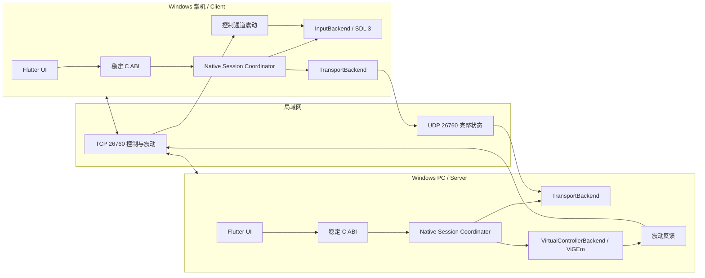

# Remote Controller 项目知识库

最后更新：2026-07-23
状态：可信局域网 MVP 功能完成并通过 ROG Ally X 双机实测，进入发布收尾
许可证：GPL-3.0-only

本文件是架构、协议、上游来源和关键实现决策的单一事实来源。修改架构、协议、依赖、驱动策略或关键实现时，必须在同一变更中更新本文件。

## 1. 项目目标与功能边界

Remote Controller 在同一局域网内把 Windows 掌机的实体手柄状态发送到 Windows PC。PC 端呈现一个虚拟 Xbox 360 手柄，PC 游戏产生的双马达震动再返回实体手柄。项目不隐藏掌机实体手柄；掌机上的其他程序仍可能读取它，这是明确接受的产品边界。

MVP 固定边界：

- 一个 Flutter Windows 可执行程序，通过角色选择运行 Client 或 Server。
- Client 首要支持 ROG Ally X 内置手柄；已知 USB VID/PID 为 `0x0B05/0x1B4C`，最终仍以 SDL 枚举结果和 Windows 设备实例路径为准。
- 单客户端、单实体手柄、单虚拟手柄。
- 标准 Xbox 控件：D-pad、A/B/X/Y、Start、Back、Guide、肩键、摇杆按压、双摇杆、双扳机。
- 保留采集后整数域中的原始轴值，不应用应用层死区、加速、灵敏度曲线或平滑。允许进行坐标约定转换，例如 SDL 的 Y 正方向到 XInput 的 Y 正方向。
- 背键、触摸板、陀螺仪、RGB、扳机震动和多手柄不在首版范围，但协议和接口须可扩展。
- 不实现音视频、远程桌面、键盘、鼠标、触摸板输入、原始 USB/HID 透传或互联网中继。
- 不集成 HidHide 或其他自动输入隐藏驱动。ViGEmBus 不随应用捆绑，仅在用户明确点击后从官方固定 URL 下载、校验 SHA-256，并通过标准 Windows UAC 启动交互式安装器。

## 2. 总体架构与模块职责



### Flutter 层

- `ui/`：只负责界面、交互和展示状态；采用 View + `ChangeNotifier` ViewModel。
- `data/repositories/`：向 ViewModel 提供领域对象，是界面的单一数据入口。
- `data/services/`：封装 FFI 调用，不承担实时循环。
- `VigemInstallerService`：在用户触发后下载固定 ViGEmBus 资产、限制大小、校验 SHA-256、维护当前用户临时缓存，并在后台 isolate 请求原生 UAC 启动；View 不直接访问网络或进程 API。
- `domain/models/`：角色、核心状态、设备/会话展示模型。
- Flutter 通过轮询事件或原生端口通知获得低频状态；任何输入采样、网络收发或虚拟手柄提交都不得经过 Flutter UI isolate。

### Windows C/C++ 核心

- Session Coordinator：状态机、生命周期、超时、停止顺序和后端组合。
- `InputBackend`：枚举、打开、读取实体手柄以及执行震动。
- `TransportBackend`：发现、控制、输入传输和反馈；具体实现可替换。
- `VirtualControllerBackend`：创建/销毁虚拟设备、提交完整状态、立即提交中立状态、接收震动回调。
- 当前传输限定可信局域网；身份、配对和 AEAD 属于发布后的可选安全增强，不是首版完成条件。

当前 C++ 后端接口位于 `packages/remote_controller_core/native/include/backends/`，协议布局位于 `native/include/controller_protocol.h`。`Session` 组合具体后端并拥有状态机、sequence 校验和 watchdog；本机链路诊断组合为异步 `LoopbackTransportBackend` + `MemoryVirtualControllerBackend`。`UdpLanTransportBackend` 是首个真实网络实现，在 TCP 26760 上承载握手、心跳、停止和震动，在 UDP 26760 上承载完整状态。`LanControllerClient` 组合 SDL → UDP，并把 TCP 震动投递回 SDL；`LanControllerServer` 组合 UDP → ViGEm，并以本机到达时间执行 watchdog。`SdlInputBackend` 是首个实体 `InputBackend`，`VigemVirtualControllerBackend` 是首个系统虚拟手柄实现。`InputCapture` 和 `LocalControllerBridge` 继续作为独立硬件诊断生命周期，同一时刻不会与 LAN Client 打开同一设备。

## 3. Flutter FFI 边界

FFI 只暴露面向会话的粗粒度 API，不暴露 C++ 类、STL 类型或实时数据回调。所有结构带 `size`/`version`，字符串使用 UTF-8，资源通过 opaque handle 管理。

未来若统一当前多个诊断/会话 handle，可增加配置和事件轮询 ABI：

```c
rc_handle* rc_create_v1(const rc_config_v1* config);
rc_result rc_start(rc_handle* handle);
void rc_stop(rc_handle* handle);
void rc_destroy(rc_handle* handle);
rc_result rc_get_status(rc_handle* handle, rc_status_v1* out_status);
rc_result rc_poll_event(rc_handle* handle, rc_event_v1* out_event);
rc_result rc_list_input_devices(rc_handle* handle, rc_device_list_v1* out_devices);
rc_result rc_select_device(rc_handle* handle, const char* device_id_utf8);
```

已经实现的 ABI：

- `rc_get_abi_version()`：当前返回 1。
- `rc_get_build_info()`：返回进程生命周期有效的 UTF-8 构建描述。
- `rc_sdl_get_runtime_info()`：返回 SDL 是否可用、精确整数版本、revision 和可展示错误；运行时不可用本身不使诊断调用失败。
- `rc_sdl_enumerate_gamepads()`：两阶段枚举 SDL 标准手柄；返回 instance ID、名称、路径、GUID、VID/PID、产品版本、SDL 类型、连接状态、能力、支持按钮和设备标志。
- `rc_sdl_capture_create()` / `rc_input_capture_destroy()`：创建和销毁单设备 opaque `rc_input_capture`。
- `rc_input_capture_start()` / `rc_input_capture_stop()`：启动或停止原生采样线程；停止后当前状态立即清零。
- `rc_input_capture_get_snapshot()`：仅供 UI 低频读取当前完整状态、样本计数、单调时间戳、已见按钮、扳机峰值和四轴范围。
- `rc_vigem_get_runtime_info()`：探测当前进程能否连接 ViGEmBus，返回原始 ViGEm 结果码和可展示错误；探测不会创建 target。
- `rc_vigem_launch_installer()`：接收已经由 Dart 服务完成来源和 SHA-256 校验的绝对 UTF-8 路径，通过 Windows `ShellExecuteExW` + `runas` 显示标准 UAC 并启动交互式安装器；返回是否成功发起和 Win32 错误码，不等待安装完成。
- `rc_local_bridge_create()` / `rc_local_bridge_destroy()`：创建和销毁本机诊断用 opaque `rc_local_controller_bridge`，内部固定组合 SDL 输入和单个 ViGEm X360 target。
- `rc_local_bridge_start()` / `rc_local_bridge_stop()`：启动/停止原生 SDL → ViGEm 链路；Stop 幂等，先停止输入、提交中立状态，再移除 target。
- `rc_local_bridge_get_snapshot()`：仅供 Flutter 低频读取状态、样本数、当前完整输入以及最近双马达值和震动回调计数。
- `rc_lan_client_create()` / `rc_lan_client_destroy()`：创建和销毁单设备 LAN Client opaque handle；配置目标 IPv4/主机名和端口，当前默认 26760。
- `rc_lan_client_start()` / `rc_lan_client_stop()`：原生启动 TCP 握手、SDL worker 和 UDP 完整状态发送；正常 Stop 先停止 SDL，再尽力发送最终中立状态并关闭控制通道。
- `rc_lan_server_create()` / `rc_lan_server_destroy()`：创建和销毁单客户端 LAN Server opaque handle；配置监听端口和 `10..5000 ms` 输入 watchdog，产品默认 100 ms。
- `rc_lan_server_start()` / `rc_lan_server_stop()`：创建 ViGEm X360 target，在原生 worker 中等待 TCP Client 并接收 UDP；Stop 和控制通道断开都走安全归零路径。
- `rc_lan_client_get_snapshot()` / `rc_lan_server_get_snapshot()`：低频返回连接状态、对端地址、收发/丢弃计数、sequence、当前完整状态、归零次数、震动和 Winsock 错误。
- `rc_session_create_loopback()` / `rc_session_destroy()`：创建和销毁 opaque `rc_session`；超时允许 `10..5000 ms`，产品默认值为 100 ms。
- `rc_session_start()` / `rc_session_stop()`：严格执行 `created → running → stopped` 生命周期；Stop 幂等并先提交中立状态。
- `rc_session_submit_state()`：提交完整 16 字节状态、64 位 sequence 和 Client 单调时间戳；相同或倒退 sequence 返回 `RC_RESULT_STALE_SEQUENCE`。
- `rc_session_get_snapshot()`：低频读取状态机、最新 sequence、接收/归零计数、输入时间戳和当前完整输出状态。
- `rc_session_simulate_disconnect()`：仅用于诊断断线安全路径；真实传输后端将从控制通道关闭回调进入同一路径。

当前公开状态结构均以 `struct_size` 开头：`rc_session_snapshot_v1` 为 56 字节，`rc_sdl_runtime_info_v1` 为 336 字节，`rc_input_device_info_v1` 为 712 字节，`rc_input_capture_snapshot_v1` 为 64 字节，`rc_vigem_runtime_info_v1` 为 272 字节，`rc_vigem_installer_launch_result_v1` 为 16 字节，`rc_local_bridge_snapshot_v1` 为 56 字节，`rc_lan_session_snapshot_v1` 为 416 字节；`rc_gamepad_state_v1` 与 wire 明文同为 16 字节。opaque handle 不跨 DLL 暴露 C++、STL 或线程对象。Dart `LoopbackSession`、`SdlInputCapture`、`LocalControllerBridge`、`LanControllerClient` 和 `LanControllerServer` 都是显式 `close()` 资源；Flutter 只以 10 Hz 读取诊断快照，250 Hz 采样、socket 收发、ViGEm 提交和震动执行不经 Dart 往返。

绑定由 `packages/remote_controller_core/tool/ffigen.dart` 生成到 `lib/src/third_party/`，不得手写 `DynamicLibrary.lookup`。Native Assets 通过 `hook/build.dart` 和 `hook/link.dart` 构建 C++20 动态库并根据记录的符号使用进行链接裁剪。

## 4. 线程模型

### 通用线程

- Flutter UI isolate：设置和状态展示；不进入实时路径。
- Native control thread：会话状态机、TCP 控制消息、1 秒心跳和震动。
- Native event queue：有界 MPSC 队列，把状态/错误事件交给 FFI；队列满时合并重复状态，不能丢失致命错误。

当前已实现的诊断线程：

- SDL capture worker：`SdlInputBackend::PollLoop()` 在独立 `std::thread` 中每 4 ms 调用 `SDL_UpdateGamepads()` 并读取一份完整状态，目标频率 250 Hz；Flutter 定时器只每 100 ms 读取一次累计快照。停止使用原子标志并 join，设备断开时回调 `InputCapture` 把当前状态立即清零并进入 `disconnected`。
- Local bridge real-time path：同一个 SDL worker 每 4 ms 把完整状态直接提交到 `VigemVirtualControllerBackend`，不经过 Dart、Flutter Timer 或 UI isolate。ViGEm 通知线程只调用轻量回调；回调将 8 位马达值乘 `257` 扩展为 16 位并写入 SDL 后端的原子 pending slot，实际 `SDL_RumbleGamepad()` 仍由 SDL worker 执行，避免跨线程调用实体设备。
- Local bridge stop/fault：Stop 先把状态标记为 `stopped`，join SDL worker（worker 退出前清零实体震动），再向虚拟 target 提交中立状态并注销通知、移除 target、断开 client。设备断开或 ViGEm update 失败时立即向 target 提交中立状态并进入 `disconnected/faulted`；Flutter 只展示终态并等待显式 Stop/销毁完成资源回收。
- Loopback transport worker：`SendState()` 把带 sequence/timestamp 的完整 `StateFrame` 写入最大 64 项的有界队列并唤醒工作线程；仅当相邻状态的按钮掩码完全相同时覆盖队尾，从而允许高频轴状态合并但不丢失按下/松开边沿。队列耗尽时会话失败并安全归零，不静默丢边沿。工作线程回调 Session，调用者线程不直接执行虚拟手柄提交。
- Session watchdog：独立线程以本机 `steady_clock` 计算接收超时，不信任远端 timestamp；每段输入静默期只提交一次中立状态，收到新合法状态后重新布防。
- LAN Client start/control：`rc_lan_client_start()` 只创建原生启动 worker 并立即返回；worker 在最多 3 秒的可取消连接窗口内完成 TCP 握手，随后打开 SDL。SDL worker 每 4 ms 直接调用 UDP `SendState()`；TCP control worker 每秒发送 heartbeat，并把可靠 rumble 写入 SDL 的原子 pending slot。
- LAN Server accept/control/input：启动 worker 在 TCP listener 上等待单个 Client；握手后分别启动 TCP control worker 和 UDP input worker。UDP worker校验固定长度、magic/version、诊断标志、随机 session ID、TCP 对端 IPv4 和严格递增 sequence，再直接提交 ViGEm。ViGEm callback 只更新原子 rumble slot，TCP control worker 去重发送。
- LAN Server watchdog：Session worker 使用 `steady_clock` 和 100 ms 默认阈值；静默期只提交一次中立状态。TCP 关闭、3 秒 heartbeat 超时、显式 STOP 或后端错误会立即进入 `disconnected/faulted` 并中立，不等待 UDP watchdog。
- Stop 和模拟断线均显式唤醒并 join 线程。当前使用 `std::thread` + `condition_variable` 作为 C++20 `stop_token` 的等价取消机制。

### Client

- SDL input worker：每 4 ms 读取一份完整状态，维护单调 sequence 和 timestamp，并直接调用非阻塞 UDP `SendState()`；无 Dart 往返或额外堆队列。
- TCP control worker：每 1 秒发送 heartbeat，接收可靠 rumble 后写入 `SdlInputBackend` 的原子 pending slot；实际 `SDL_RumbleGamepad()` 由 SDL worker 执行。
- Client start worker：在可取消的 3 秒连接窗口内完成 TCP HELLO，再打开目标 SDL device；连接失败、设备断开和 Stop 都进入统一生命周期清理。

### Server

- UDP input worker：校验固定长度、magic/version、plaintext 标志、session ID、TCP 对端 IPv4 和严格递增 sequence，再直接提交 ViGEm；按钮边沿不合并。
- Server session worker：维护 100 ms 输入 watchdog；超时只提交一次中立状态，收到新合法状态后重新布防。
- TCP control worker：接收 heartbeat/STOP 并发送去重后的 rumble；3 秒心跳超时立即断开和归零。
- ViGEm callback thread：只复制马达值到原子 pending slot，绝不执行 socket 阻塞操作。

线程停止时使用 `std::stop_token` 或等价取消源。析构函数只是最后保险，正常路径必须显式 Stop 并 join。

## 5. 通信协议 v1

### 端口和通道

| 用途 | 传输 | 端口 | 可靠性 |
|---|---|---:|---|
| HELLO、心跳、震动、停机会话 | TCP | 26760 | 可靠有序 |
| 手柄完整状态 | UDP | 26760 | 低延迟；完整状态允许丢旧包 |
| 未来服务发现（未实现） | UDP broadcast/multicast | 26761 | 周期广播，可丢失 |

TCP 与 UDP 使用相同数字端口但独立 socket。首版由用户手动输入 PC IPv4 地址或主机名。

### 输入数据报

固定 64 字节，小端序。布局预留了未来 AEAD 区域；当前首版在状态区域放明文，尾部 16 字节固定为零。

| 偏移 | 大小 | 字段 | 说明 |
|---:|---:|---|---|
| 0 | 4 | magic | `RCI1` / `0x31494352` |
| 4 | 1 | version | 1 |
| 5 | 1 | message_type | 1 = full state |
| 6 | 2 | flags | `0x0001` = trusted-LAN plaintext |
| 8 | 2 | packet_length | 64 |
| 10 | 2 | header_length | 32 |
| 12 | 4 | session_id | Client 每次连接随机生成，不能为 0 |
| 16 | 8 | sequence | 从 1 开始单调递增，不回绕复用 |
| 24 | 8 | timestamp_us | Client 单调时钟微秒，只用于测量和排序 |
| 32 | 16 | encrypted_state | 首版直接存放下表明文；字段名为未来 AEAD 预留 |
| 48 | 16 | authentication_tag | 首版必须全零 |

状态明文：

| 偏移（状态内） | 大小 | 字段 | 数值域 |
|---:|---:|---|---|
| 0 | 4 | button_flags | Moonlight/Sunshine 兼容 32 位掩码 |
| 4 | 2 | left_trigger | `0..65535` 原始归一整数 |
| 6 | 2 | right_trigger | `0..65535` 原始归一整数 |
| 8 | 2 | left_stick_x | `-32768..32767` |
| 10 | 2 | left_stick_y | `-32768..32767` |
| 12 | 2 | right_stick_x | `-32768..32767` |
| 14 | 2 | right_stick_y | `-32768..32767` |

Xbox 360 虚拟报告的扳机只有 8 位。Server 在最终 ViGEm 边界进行确定性 `uint16 -> uint8` 量化；网络和 Client 内部始终保留 16 位数值。不得在传输前缩减精度。

可信局域网 MVP 复用同一 64 字节布局，将 16 字节状态直接放入 `encrypted_state` 区、认证标签固定全零，并设置 `kInputFlagTrustedLanPlaintext (0x0001)`。`UdpLanTransportBackend` 同时校验随机 session ID、TCP 对端 IPv4、严格递增 sequence、长度和保留字段。该标志明确表示报文不具备认证或保密性，不能用于互联网或不受信任网络。

当前 SDL 3 采集转换固定如下：

- 摇杆 X 轴直接保留 SDL `Sint16` 数值。
- SDL Y 轴为向下为正，协议/XInput 约定为向上为正，因此只执行符号反转；`-32768` 饱和到 `32767`，不引入死区或曲线。
- SDL 标准手柄扳机有效域为 `0..32767`，线性扩展到 `0..65535`，使用 `(value * 65535 + 16383) / 32767` 做最近整数舍入；负值归零。
- 每次样本都重新读取并形成完整按钮、双扳机和四轴状态，不依赖增量事件。

按钮位：

| 位 | 值 | 控件 |
|---:|---:|---|
| 0..3 | `0x0001..0x0008` | D-pad 上/下/左/右 |
| 4..9 | `0x0010..0x0200` | Start、Back、LS、RS、LB、RB |
| 10 | `0x0400` | Guide/Home |
| 12..15 | `0x1000..0x8000` | A、B、X、Y |

高 16 位保留 Moonlight/Sunshine 扩展（paddles、touchpad、misc），MVP 不发送但不得截断。

### 发布后可选的加密与配对

当前 MVP 没有加密或身份认证。如果未来需要支持共享办公网络或其他不完全可信环境，可另行引入 Ed25519/X25519、HKDF、ChaCha20-Poly1305、DPAPI 身份存储和六位确认。实现时必须使用固定并审计的密码学库，不自行实现原语，并让安全 transport 拒绝 plaintext 标志。

### 控制消息

plaintext control 使用固定 32 字节小端帧，magic 为 `RCC1`，消息实现 `HELLO`、`HELLO_ACK`、`HEARTBEAT`、`RUMBLE`、`STOP` 和错误断开；它没有身份、能力协商、加密或滑动重放窗口。Client 每 1 秒 heartbeat，Server 3 秒未收到即立即断开并归零。震动只由 Server TCP control worker 发送，ViGEm callback 不执行 socket I/O。

## 6. 故障恢复和安全释放

任何不确定状态都以“释放所有控件”为安全结果：

- Server 100 ms 无合法输入：立即向虚拟手柄提交一次中立完整状态，并保持中立直到收到更新会话或有效恢复包。
- TCP 控制通道关闭、非法控制帧、session ID 变化或显式 STOP：立即中立，不等待 100 ms。
- 控制心跳每 1 秒；3 秒无心跳认定会话死亡并销毁虚拟手柄。
- 新会话不接受旧会话 sequence；序列倒退和重复包不改变当前状态。
- Client 正常停止顺序：停止采样 → 尽力发送最终中立状态 → 停止传输 → 关闭设备。
- Client 崩溃：Windows 回收 socket 与 SDL 句柄；Server 在 TCP 断开或心跳超时后立即中立并移除 target。
- Server 崩溃：ViGEm 客户端句柄关闭会移除目标；仍在显式 Stop 中先提交中立再移除。
- 网络恢复不复用已死亡会话。重新握手并创建新 session ID，避免陈旧按键复活。

当前 loopback 实现已验证上述规则的共同底座：状态机包含 `created/running/stopped/disconnected/faulted`；超时、Stop、断线和后端故障都调用同一个中立提交函数。sequence 在进入异步最新状态槽前同步检查，并在消费时再次防御性检查。`disconnected` 是终态，必须销毁 handle 后创建新会话。

## 7. Client 输入可见性

首版不实现输入独占，也不依赖 HidHide 或其他过滤驱动。SDL 打开的实体手柄继续对掌机上的其他进程可见。

- 局域网模式只在 PC 上创建 ViGEm target，因此不会在同一台机器上同时暴露实体和虚拟手柄。
- 掌机端若有 Armoury Crate、游戏或按键映射工具同时消费手柄，用户需要自行关闭冲突程序。
- 本机 SDL → ViGEm bridge 会在同一台机器同时暴露实体与虚拟设备，永久保留为硬件诊断工具，并在 UI 中明确警告可能双输入。
- 项目不修改设备驱动配置、不重启设备、不要求管理员权限来读取手柄。

## 8. 虚拟手柄后端方案

MVP 使用 ViGEmBus + ViGEmClient 创建 Xbox 360 target：

1. `vigem_alloc()` / `vigem_connect()` 检测驱动和总线版本。
2. `vigem_target_x360_alloc()` / `vigem_target_add()` 创建唯一 target。
3. 将 Moonlight 按钮掩码映射到 `XUSB_REPORT.wButtons`，轴原样写入 `sThumb*`，扳机在最终边界量化到 `b*Trigger`。
4. `vigem_target_x360_update()` 提交每个最新完整状态。
5. `vigem_target_x360_register_notification()` 接收 8 位双马达输出，扩展到 16 位后去重并可靠回传。
6. Stop 时中立、取消回调、`vigem_target_remove()`、释放 target、断开 client。

Sunshine `src/platform/windows/input.cpp` 中 `vigem_t::alloc_gamepad_internal()`、`free_target()`、`x360_buttons()`、`x360_update_state()`、`gamepad_update()` 和 `x360_notify()` 是主要参考。其 RAII 和“回调只入队”原则可复用；Boost 日志、全局 task pool、多手柄/DS4 分支和 Sunshine 配置系统必须去除。

ViGEmBus 已归档，但在 MVP 的 Windows 兼容性和 Sunshine 验证基础上仍是首选。接口隔离允许后续替换为 VirtualPad、vhidmini 或其他签名驱动。应用检测缺失后只显示官方安装链接，不捆绑安装程序。

当前实现固定 LizardByte/Sunshine 使用的 ViGEmClient fork 修订 `8d71f6740ffff4671cdadbca255ce528e3cd3fef`（上游版本 `1.21.222.0`）。Native Assets hook 下载 GitHub commit archive，校验 SHA-256 `2fba3b63c3fdabe2664a30645b0e8ad79e52a11be628f91313d3cdbc698c121c`，只提取 `LICENSE`、四个公共/共享头、两个私有头和 `src/ViGEmClient.cpp`。源码以 MIT 许可证静态编入 `remote_controller_core.dll` 并链接系统 `setupapi`，发布目录不需要也不应出现 `ViGEmClient.dll`。离线构建可通过 `vigem_source_path` 指向该精确修订的源码目录。为避免 MSVC `MAX_PATH` 问题，hook 在自己的构建输出目录使用短路径 `vigem/`。

`VigemVirtualControllerBackend` 已实现单 target 生命周期、完整 XUSB 映射和通知回调。16 位扳机仅在 `ToXusbReport()` 最终边界以 `(value * 255 + 32767) / 65535` 做最近整数量化；四轴直接写入 XUSB `SHORT`，不施加死区或曲线。ViGEm 低频/高频 8 位马达值分别乘 `257` 恢复到 SDL 使用的 16 位域。本机诊断 `LocalControllerBridge` 会让实体和虚拟手柄同时暴露给其他进程，UI 必须持续显示双输入警告。

### ViGEmBus 安装流程

应用只在探测为不可用且用户明确点击“安装 ViGEmBus 1.22.0”后执行：

1. 从官方归档仓库的固定 Release URL 下载 `ViGEmBus_1.22.0_x64_x86_arm64.exe`。
2. 最大下载长度固定为 `6,278,576` 字节；最终大小必须精确相等。
3. SHA-256 必须等于 `89220a7865076b342892f98865f3499fb7c4cfd673159e89d352c360fd014c6a`，否则不写入最终缓存、不启动任何进程。
4. 已校验文件保存在当前用户 `%TEMP%/RemoteController/driver-installers/`；重试时重新校验缓存，不信任仅凭文件名命中的文件。
5. `rc_vigem_launch_installer()` 在后台 Dart isolate 中调用。原生端以只读且禁止写入/删除共享的句柄打开文件，通过 Windows BCrypt 再次核对固定字节数和 SHA-256，并在保持句柄期间使用 `ShellExecuteExW` 的 `runas` verb 显示 UAC，关闭校验到执行之间的文件替换窗口。安装器保持官方交互界面，不使用静默参数。
6. 原生调用只确认安装器成功启动，不等待退出。用户完成安装后点击“重新检测”；若仍不可用，UI 提示完成安装或重启 Windows。

该功能不把驱动二进制放入 Git、Flutter assets 或发布目录。2026-07-23 审计时，下载资产具有 Windows 判定为有效的 Nefarius Software Solutions e.U. Authenticode 签名；运行时完整性信任锚是 Dart 下载层和原生执行层双重固定 SHA-256，避免证书生命周期或联网吊销检查影响离线安装。

## 9. Sunshine / Moonlight 源码分析

### 已审阅基线

| 仓库 | 修订 | 许可证 |
|---|---|---|
| LizardByte/Sunshine | `93fc98394f4edd492e21d25b5833d29cef4123cc` | GPL-3.0 |
| moonlight-stream/moonlight-qt | `2328713f4e7b8442e6bd49238b4eba27031a4d9f` | GPL-3.0 |
| moonlight-stream/moonlight-common-c | `703a06946861ff82cd33e5e13c59c1b017f7ded9` | GPL-3.0 |
| LizardByte/Virtual-Gamepad-Emulation-Client | `8d71f6740ffff4671cdadbca255ce528e3cd3fef` | MIT |
| libsdl-org/SDL | `3.4.12` / `f87239e71e42da91ca317a12eefb82cfbf3393eb` | zlib |

### Sunshine

- `src/platform/common.h`
  - `DPAD_UP`…`Y`、`PADDLE1`…`MISC_BUTTON`：Moonlight 兼容按钮位。
  - `gamepad_state_t`：32 位按钮、8 位扳机、4 个 16 位摇杆。
  - `gamepad_arrival_t`：type、capabilities、supportedButtons。
  - `gamepad_feedback_msg_t` / `feedback_queue_t`：震动等反馈从平台后端返回会话的消息模型。
  - `alloc_gamepad()`、`gamepad_update()`、`free_gamepad()`：平台无关生命周期接口。
- `src/platform/windows/input.cpp`
  - `vigem_t` 管理 client 和 target；`alloc_gamepad_internal()`、`free_target()` 实现连接生命周期。
  - `x360_buttons()`、`x360_update_state()` 是最小 Xbox 映射参考，未施加死区或曲线。
  - `x360_notify()` 将 ViGEm 8 位马达值提升到 16 位、去重并通过队列回传。
  - 不应复制 DS4、触摸、传感器、键鼠和 Boost/task_pool 依赖。
- `src/input.cpp`
  - 负责网络输入消息到平台接口的分发、gamepad arrival/removal 和客户端相对 ID。MVP 只借鉴状态机和“释放时送中立状态”，不导入其键鼠路径。
- `src/stream.cpp`
  - 将平台 feedback queue 转成 Moonlight 控制消息。MVP 采用独立的轻量 TCP 控制协议，复用反馈方向思想，不复用视频会话结构。

### Moonlight Qt

- `app/streaming/input/gamepad.cpp`
  - `k_ButtonMap` 将 SDL 标准按钮映射到 Moonlight 掩码。
  - `handleControllerAxisEvent()` 合并连续轴事件，摇杆保持 `int16`；Y 轴只做方向转换；旧协议把扳机缩为 8 位。
  - `sendGamepadState()` 始终发送完整状态；断开和特殊退出路径显式发送全零状态。
  - 设备到达时查询 supported buttons、analog trigger、rumble、touch/sensor/battery 能力并发送 arrival。
  - rumble/rumbleTriggers 将服务端反馈送回 SDL。
  - 鼠标模拟、快捷键组合、overlay 和 Qt Session 依赖不在范围内。
- `app/streaming/input/input.h`
  - `GamepadState` 和 SdlInputHandler 的设备槽/反馈接口可作为 SDL 后端形状参考；MVP 改成单设备 C++ 后端，不引入 Qt。

### moonlight-common-c

- `src/Limelight.h`
  - `*_FLAG`、`LI_CTYPE_*`、`LI_CCAP_*` 定义按钮、控制器类型和能力位。
  - `LiSendMultiControllerEvent()`、`LiSendControllerArrivalEvent()`、震动回调定义了端到端语义。
- `src/Input.h`
  - `MULTI_CONTROLLER_PACKET` 及 Sunshine 扩展把高 16 位按钮分开放置；这是保持 32 位掩码的依据。
- `src/InputStream.c`
  - `sendControllerEventInternal()`/`LiSendMultiControllerEvent()` 进行小端序序列化并用 `currentQueuedControllerPacket` 合并待发状态。
  - arrival 使用独立可靠 ENet channel；不同类型事件采取不同可靠性。
  - 现有包混合旧 GameStream 世代兼容、8 位扳机、无本项目 session/timestamp/AEAD，不能直接作为本项目 wire format。

### ViGEmClient

- ViGEmClient `include/ViGEm/Client.h` 与 `src/ViGEmClient.cpp`：当前只构建 client lifecycle、X360 target、update 和 notification 所需的固定修订最小源码集合；不 vendor 完整仓库，也不引入其构建系统、示例或发布二进制。

### 已落地的 SDL 复用

- `native/src/sdl_input_backend.cpp` 的 `kButtonMap` 按 Moonlight Qt `app/streaming/input/gamepad.cpp` 的标准 SDL 顺序适配，并使用 Sunshine `src/platform/common.h` 的 GPL-3.0 按钮位；未导入 Qt、GameStream 或音视频模块。
- `native/include/controller_protocol.h` 已加入 Sunshine/Moonlight 的 paddle、touchpad、misc 高位扩展，协议和 Dart 模型全程保持 32 位掩码。
- SDL 本身不复制源码树。Native Assets hook 固定官方 SDL `3.4.12` VC SDK，校验归档 SHA-256 后只提取编译头文件、目标架构运行库和许可证。

### ROG Ally X 实机采样基线（2026-07-23）

- SDL 名称：`XInput Controller #1`
- VID/PID：`0x0B05/0x1B4C`
- GUID：`03000fa67050b00004c1b000002007801`
- 路径：`XInput#0`
- SDL 报告支持按钮：`0x00007FFF`；本次覆盖到的实际按钮：`0x0000F38F`
- LT/RT 观察范围：`0..65535`
- LX 观察范围：`-32768..32767`
- LY/RX/RY 观察范围：约 `-32767..32767`
- 连续记录超过 25,000 个样本，约 250 Hz，按键和轴输入正常；随后已验证本机 SDL → ViGEm 映射和 ROG Ally X → PC 双机局域网完整链路，用户反馈功能正常。

## 10. 可复用与必须重写的边界

### 可直接提取/适配（保留来源和版权）

- Moonlight/Sunshine 按钮位、控制器类型、能力位常量。
- Sunshine 的 Xbox 按钮映射、完整报告赋值和震动值转换逻辑。
- Moonlight Qt 的 SDL 按钮映射表、能力探测和轴事件合并规则，迁移到 SDL 3 API。
- ViGEmClient 公共 API 头/库作为依赖，或最小封装调用序列。

### 只复用设计，不复制实现

- moonlight-common-c 的 ENet channel 分离、完整状态合并、arrival/capability 和 feedback 语义。
- Sunshine 的 feedback queue、target RAII、错误报告和停止顺序。
- Moonlight 的断开时全零状态和设备移除处理。

### 必须重写

- 本项目的 session、sequence、timestamp、watchdog 和轻量 TCP/UDP framing。
- 16 位扳机 wire model；Moonlight 旧包使用 8 位。
- 单应用 Client/Server 会话状态机和 FFI ABI。
- 不依赖 Qt、Boost、Sunshine 音视频/HTTP 配置或 GameStream 协议的轻量传输层。
- Flutter UI 和应用数据层。

## 11. 技术决策记录（ADR 摘要）

### ADR-001：单 Flutter 应用，双角色

决定：同一 Windows 应用选择 Client 或 Server。共享诊断、驱动状态和 FFI，减少安装包数量。原生会话同一时刻只能启动一个角色。

### ADR-002：Native Assets + FFIgen

决定：C++ 由 Dart Native Assets hooks 调用 MSVC 构建；绑定由 FFIgen 生成，避免手工 ABI 漂移。Flutter 只调用稳定 C ABI。

### ADR-003：完整状态而非增量事件

决定：每个输入包携带完整手柄状态。丢包不会造成永久卡键，Server 可按 sequence 直接丢弃旧包，代价是固定 64 字节数据报。

### ADR-004：控制与输入分离

决定：控制/反馈用可靠 TCP，输入用 UDP。避免 TCP 队头阻塞输入，同时让心跳、Stop 和震动可靠交付。

### ADR-005：16 位扳机内部模型

决定：网络保留 SDL/通用后端可表达的 16 位精度，只有 X360 输出边界量化到 8 位。未来更高精度虚拟后端无需改协议。

### ADR-006：不做 Client 输入隐藏

决定：首版不集成 HidHide 或其他输入过滤驱动。掌机实体手柄保持可见，项目不修改系统设备配置，也不承担过滤驱动安装、提权、崩溃回滚和 Armoury Crate 兼容成本。局域网虚拟手柄只存在于 PC，因此正常双机模式不会在同机产生实体/虚拟双输入。

### ADR-007：驱动不随包分发

决定：ViGEmBus 不随应用安装包分发。用户明确操作后，应用下载官方固定资产、做大小与 SHA-256 校验，再启动原始交互式安装器。这样保留便捷安装，同时避免重新打包签名驱动或静默改变系统。

### ADR-008：opaque Session ABI 与原生 loopback 先行

决定：在引入 SDL、LAN 和 ViGEm 前，先用同一套 `Session` 状态机组合异步内存后端。C ABI 只暴露 opaque handle、完整状态提交和低频 snapshot；实时回调留在 C++。loopback 使用有界完整状态队列，仅合并按钮掩码相同的连续轴状态，保留所有按钮边沿，并让超时/断线安全行为可以在无驱动机器上稳定测试。

### ADR-009：固定 SDL 官方运行库并在核心旁动态加载

决定：M1 固定 SDL `3.4.12`。Native Assets hook 下载官方 `SDL3-devel-3.4.12-VC.zip` 并校验 SHA-256 `8793a153c7eba93b1eb8022fd2356383ec446b2584e43724a72ef68d682813ab`；离线环境可通过 `sdl_sdk_path` 指向已解压的官方 SDK。构建只使用头文件，`remote_controller_core.dll` 不产生静态 SDL 导入依赖；运行时从核心 DLL 同目录显式加载 `SDL3.dll`，解析最小手柄 API，并拒绝非精确 `3.4.12` 版本。这样可由 Native Assets 正确打包运行库、提供清晰诊断，也避免从系统搜索路径意外加载不兼容 DLL。

### ADR-010：固定 ViGEmClient 源码并静态编入核心

决定：M1 使用 Sunshine 已审阅的 LizardByte ViGEmClient fork 修订 `8d71f6740ffff4671cdadbca255ce528e3cd3fef`。Native Assets 下载并校验 commit archive，只提取八个必要文件，随后静态编入 `remote_controller_core.dll`；不依赖单独的 `ViGEmClient.dll`，也不重新分发 ViGEmBus 驱动。这样可固定 ABI/源码来源、保留对应源码获取路径，并缩小第三方代码面。`VirtualControllerBackend` 仍作为替换边界，避免长期绑定已归档驱动。

### ADR-011：固定哈希的显式 ViGEmBus 安装入口

决定：安装入口固定 ViGEmBus `v1.22.0` 单一通用安装器、精确字节数和 SHA-256。Flutter data service 在下载和缓存时校验；Windows 原生核心在执行前用 BCrypt 复验并锁定文件；ViewModel 管理状态，View 不访问网络或 Shell API。安装必须由用户点击并经过可见 UAC/官方安装 UI，不提供静默参数。原生启动位于后台 isolate，避免 UAC 响应期间阻塞 Flutter UI。

### ADR-012：先验证分离通道，再接入密码学

决定：首版使用 trusted-LAN plaintext transport，同端口的独立 TCP/UDP socket 承载 Client SDL → UDP → Server ViGEm 和 TCP 震动回程。它使用固定 64 字节输入布局、随机 session ID、严格 sequence 和 watchdog，但不提供身份认证或保密性。UI 必须持续显示“可信 LAN · 未加密”。加密配对可作为后续增强，但不阻塞当前 MVP 发布。

## 12. 已知风险和待验证事项

| 风险 | 影响 | 下一步 |
|---|---|---|
| ROG Ally X 在不同 Armoury Crate 模式下设备拓扑变化 | 可能枚举到不同名称或 instance ID | UI 始终展示当前 SDL 枚举结果，允许用户重新扫描和选择 |
| 仅凭 `0x0B05/0x1B4C` 标识 ROG Ally X | 固件或控制模式变化时可能漏识别 | 该标识只用于 UI 候选标签，不限制其他 SDL 标准手柄 |
| SDL 4 ms 轮询不是硬实时调度 | Windows 调度抖动可能使瞬时采样低于 250 Hz | 记录本机单调时间戳与样本统计，实机测量，不在 UI 线程补偿 |
| SDL SDK 首次构建需要网络 | 离线或 GitHub 不可达时构建失败 | 校验明确错误并支持 `sdl_sdk_path` 本地官方 SDK |
| ViGEmBus 已归档 | 长期 Windows 兼容和安全维护不确定 | 保持 VirtualControllerBackend，可替换后端 |
| 掌机其他程序同时消费实体手柄 | 本机快捷键或游戏可能与 Client 抢占输入语义 | 文档要求关闭冲突程序；项目不自动修改驱动或系统配置 |
| 本机 bridge 同时暴露实体和 ViGEm target | 本机游戏可能产生双输入 | UI 持续警告；bridge 只作为硬件诊断，不作为正式双机模式 |
| ViGEmClient 源码首次构建需要网络且 MSVC 路径较深 | GitHub 不可达或 `MAX_PATH` 可导致构建失败 | 校验明确错误，支持 `vigem_source_path`，并在 hook 输出下使用短路径 `vigem/` |
| ViGEmBus 安装状态与 Windows 更新兼容性 | target 创建或震动通知可能在部分机器失败 | UI 显示原始结果码；分别验证开发 PC 和 ROG Ally X；失败时始终中立并销毁 target |
| ViGEmBus 官方仓库已归档且安装器资产可能未来下线 | 新设备无法从固定 URL 在线安装 | 固定版本、URL、大小和 SHA-256；下载失败给出明确错误，未来可增加用户选择本地已校验安装器，不自动切换镜像 |
| 固定安装器未来发现安全问题 | 继续提供旧驱动会扩大风险 | 在新版本发布前人工审计；通过应用版本更新撤销或替换固定哈希，不接受服务器端动态改写 |
| 安装器启动不代表驱动立即可用 | 用户可能未完成向导、取消、需要重启或遇到旧版升级问题 | 明确显示“已启动”而非“已安装”，要求重新检测；官方说明原地升级可能需运行两次 |
| Windows 防火墙首次监听提示 | 自动发现/连接失败 | 应用内诊断端口和防火墙状态，签名安装阶段添加规则 |
| 当前 LAN 模式未认证或加密 | 同一网络内攻击者可观察或注入控制器状态 | UI 明示只用于可信 LAN；限制 session ID 和 TCP 对端 IP；互联网或访客网络不受支持 |
| 当前 LAN 模式只支持 IPv4 单客户端 | IPv6-only、复杂 DNS 或多客户端环境不可用 | 作为首版固定边界；后续按实际需求扩展 |
| UDP Wi-Fi 抖动与乱序 | 短时输入延迟 | 最新状态、sequence、250 Hz 上限、20 ms heartbeat、统计面板 |
| 100 ms 释放阈值误触发 | 抖动时出现瞬时松键 | 实测后调参，但不放宽“卡键安全”原则 |
| `native_toolchain_c 0.19.2` 用系统编码解析 `vswhere -utf8` | 中文 VS 描述导致纯 Dart hook 发现失败 | Flutter 命令会提供编译器路径；纯 Dart 命令问题已记录，必要时提交上游修复 |
| `native_toolchain_c 0.19.2` 的 C++ `CLibrary.link()` 把 `/TP` 带入 MSVC 链接 | `.lib` 被误作 C++ 源文件 | 构建阶段保留 `Language.cpp`，链接阶段使用独立默认 C-mode `CLinker`；升级依赖后复测 |
| FFIgen 需要 libclang | 新开发机生成绑定失败 | 文档化 LLVM/libclang 前置条件；已提交生成结果 |

## 13. MVP 阶段计划

### M0：仓库与可构建骨架

- [x] Git/Flutter Windows/Dart package 初始化。
- [x] Native Assets C++20 编译定义和烟雾 C ABI。
- [x] FFIgen 生成绑定与 Dart facade。
- [x] Flutter MVVM 角色选择和占位工作流。
- [x] 后端抽象和 v1 固定输入数据报结构。
- [x] 单元/Widget 测试骨架、许可证和知识库。
- [x] 在当前中文 Visual Studio 环境完成 Native Assets Debug/Release 构建兼容验证。

### M1：本机输入与虚拟输出

- [x] SDL 3 InputBackend：枚举标准手柄、选择单个 instance ID、精确识别 ROG Ally X VID/PID，并在独立 250 Hz 线程输出无死区完整状态。
- [x] SDL 原始值诊断：Flutter 显示运行时版本、设备身份/能力、当前完整状态、样本计数、已见按钮和轴/扳机范围；界面只以 10 Hz 读取快照。
- [x] ViGEm VirtualControllerBackend：固定并校验 ViGEmClient 源码、探测 ViGEmBus、创建单 X360 target、提交完整状态和接收双马达震动回调。
- [x] 本机 SDL → ViGEm 诊断桥：实时路径完全位于 C++，Flutter 只启动/停止并以 10 Hz 显示输入和震动快照；停止/断开/故障均提交中立状态。
- [x] ViGEmBus 安装入口：用户触发的官方固定资产下载、大小/SHA-256 校验、后台 isolate UAC 启动和安装后重新探测。
- [x] loopback TransportBackend：原生工作线程验证完整按钮、轴、16 位扳机、sequence 与中立超时。
- [x] opaque session/state C ABI、FFIgen Dart facade 和 Flutter 本机安全自检状态卡。
- 原生 event queue/poll ABI：在 SDL/ViGEm 产生设备和震动事件时补充，避免提前冻结无实际消费者的结构。

### M2：可信局域网传输

- [x] TCP control + UDP 完整状态、随机 session ID、对端 IPv4 限制和严格 sequence。
- [x] 100 ms watchdog、TCP 断开/心跳超时立即归零和正常 Stop 中立状态。
- [x] ViGEm → TCP → SDL 双马达震动回传。
- [x] Client/Server Flutter 配置、10 Hz 状态与收发/丢弃统计 UI。
- [x] ROG Ally X 与 Windows PC 双机实测通过。

发布后可选增强：UDP discovery、能力协商、延迟/抖动统计、身份配对与 AEAD。它们不属于当前 MVP 完成条件。

### M3：打包与稳定性

- [x] ViGEmBus 官方驱动检测和经校验的显式安装入口。
- [x] Windows CI、静态分析、Core/App 测试和 Release 构建。
- [x] 发布检查清单、双机验收步骤和第三方 NOTICE。
- 防火墙、长时间、丢包、乱序、睡眠唤醒、崩溃和快速重连扩展测试。
- 签名安装包和正式 GitHub Release。

## 14. 当前实现状态和后续任务

当前实现：

- Flutter Windows 工程位于 `apps/remote_controller`，已有 Client/Server 角色选择、原生 ABI 健康状态、本机链路安全自检、SDL 设备列表、原始状态记录、ViGEmBus 状态、本机 SDL → ViGEm 桥接，以及 trusted-LAN Client/Server 配置和 10 Hz 网络统计界面。
- 核心包位于 `packages/remote_controller_core`，Native Assets 编译 C++20 Session、SDL input、input capture、loopback transport、`UdpLanTransportBackend`、Client/Server session coordinator、memory virtual controller、ViGEm X360 backend、本机桥接和 C ABI，并把 `SDL3.dll` 打包到应用旁；ViGEmClient 源码静态编入核心 DLL，网络新增系统 `ws2_32` 依赖。
- `rc_get_*`、`rc_sdl_*`、`rc_input_capture_*`、`rc_vigem_*`、`rc_local_bridge_*`、`rc_lan_*` 与 `rc_session_*` 全部通过 `tool/ffigen.dart` 生成的 `@Native` 绑定接入 Dart，没有手写 FFI 函数或结构。
- `InputBackend`、`TransportBackend`、`VirtualControllerBackend` C++ 接口已建立；输入隐藏明确不在项目范围。
- v1 64 字节输入数据报、Moonlight 按钮位和 16 位轴/扳机 Dart 模型已建立。
- opaque Session 已实现严格终态、异步完整状态传递、重复/倒退 sequence 拒绝、显式 Stop 归零、模拟断线立即归零和可配置输入 watchdog。
- Flutter 自检通过 Service → Repository → ViewModel → View 调用粗粒度 FFI，验证原始极值不变和 50 ms 测试超时归零；产品会话仍使用 100 ms 默认阈值。
- SDL `3.4.12` 已固定并精确校验；可枚举 VID/PID、GUID、路径、类型、连接状态、支持按钮、模拟扳机和震动能力。ROG Ally X 已完成首轮输入采样，确认 `0x0B05/0x1B4C`、`XInput#0`、完整轴/扳机范围和约 250 Hz 采样；不同 Armoury Crate 模式的拓扑矩阵仍未完成。
- `InputCapture` 在原生线程每 4 ms 读取完整状态，不做死区、曲线或平滑；停止/断开立即把快照状态清零。Flutter 每 100 ms 读取一次快照，不参与采样。
- `VigemVirtualControllerBackend` 已能探测驱动、创建单个 X360 target、映射完整状态和接收震动；`LocalControllerBridge` 让 SDL worker 直接驱动 ViGEm，并把震动交回同一 SDL worker 执行。Flutter 只读 100 ms 快照。
- `VigemInstallerService` 已固定 ViGEmBus `1.22.0` 官方安装器 URL、`6,278,576` 字节长度和 SHA-256；下载只由用户触发，缓存每次复验，UAC 启动经生成的 FFI ABI 进入 Windows Shell。
- 已有真实 Windows TCP/UDP socket 链路；discovery、能力协商、身份和 AEAD 为发布后可选增强。UI 明确标注网络功能为“可信 LAN · 未加密”，可信 LAN 之外不得使用。
- Core 14 项和 Flutter 应用 13 项测试已通过；localhost 测试覆盖 TCP HELLO、64 字节 UDP 原始极值、ViGEm 提交、watchdog 中立和条件式实体 SDL Client→Server。ROG Ally X 与 Windows PC 双机功能已由用户实测确认正常。
- Windows x64 Release 已构建。发布目录包含 `remote_controller.exe`、`remote_controller_core.dll`、`SDL3.dll` 和 Flutter 运行库；不包含 ViGEmBus 安装器或 `ViGEmClient.dll`。系统依赖为 `WS2_32.dll`、`SETUPAPI.dll`、`SHELL32.dll`、`bcrypt.dll` 和 `KERNEL32.dll`。ROG Ally X 本机映射、双机 LAN 和端到端功能已实测通过；未安装驱动机器上的完整 UAC 流程仍需单独验收。

紧接任务：

1. 在未安装 ViGEmBus 的测试机上验证应用内下载、UAC、安装完成/取消、需要重启和重新检测路径；确认 Release 目录始终不包含驱动安装器。
2. 使用发布检查清单完成 30 分钟持续输入、拔网线归零、正常 Stop、快速重连和睡眠唤醒测试。
3. 为首个公开版本准备签名策略、版本说明和 GPL-3.0 对应源码/source offer。
4. 按需评估 UDP discovery、能力协商、延迟/抖动统计或加密配对，不阻塞当前 MVP。
5. 向 `native_toolchain_c` 上游报告中文 `vswhere -utf8` 解码和 C++ `/TP` 链接问题，升级后移除兼容代码。
